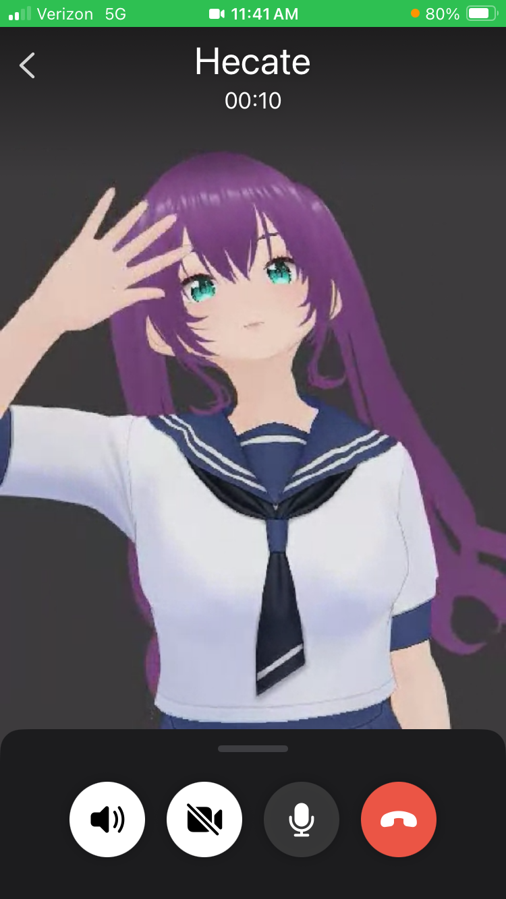
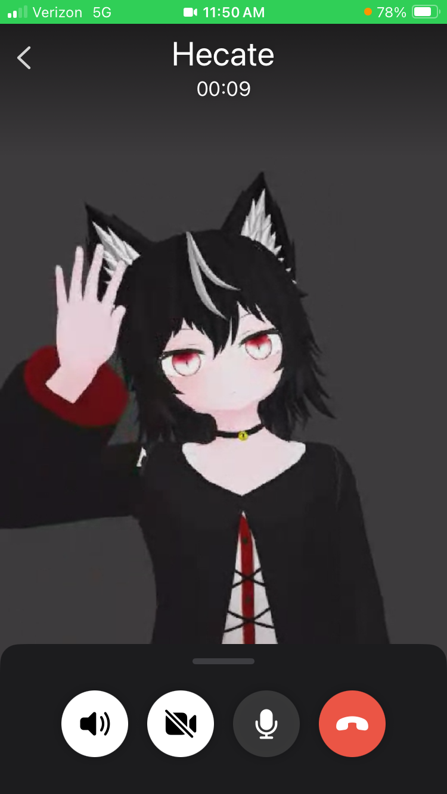
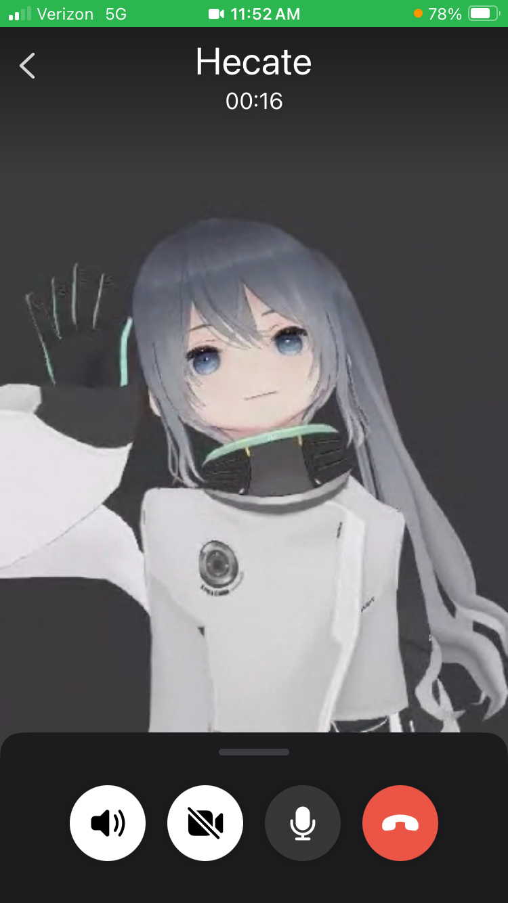

# Hecate
AI Assistant you can video call.

Works great on Linux! Works poorly on Mac. [You can help](https://github.com/rhodey/hecate/blob/main/MAC.md)!

+ [Signal](https://signal.org/) private calling
+ [Tinfoil.sh](https://tinfoil.sh/) private inference
+ [Pocket TTS](https://github.com/kyutai-labs/pocket-tts) local TTS
+ [@pixiv/three-vrm](https://github.com/pixiv/three-vrm) VR models

  

## Install Signal
You need Signal on your phone and also in an emulator:

```
just build
just emulator
just signal
```

## Register Signal
+ [http://localhost:8081](http://localhost:8081/)
+ "H264 Converter"
+ Swipe up + click Signal
+ Buy 2nd phone number + register

## Signal Desktop
We now setup Signal Desktop because it uses less CPU and is easier to automate. Run `just desktop qrcode` then `docker logs -f qrcode` you should see "!! new code" and "!! same code". Return to [http://localhost:8081](http://localhost:8081/) and do Signal > Settings > Linked devices > Link a new device.

## Voice calls
Signal Desktop should now be ready. To verify this do `chrome://inspect/#devices` > localhost:9222 > Signal > inspect fallback. Then send a text message from this Signal Desktop window to your main number so the new contact request can be accepted. And now you are ready.

```
docker rm -f emulator qrcode
cp example.env .env
just loop
```

+ Call 2nd phone number ✅
+ Say "Whats your favorite Pirates Of The Caribbean movie?"

## Video calls
I got video calls working using only docker + chrome but CPU was too high. [OBS Studio](https://obsproject.com/) is open source and cross-platform and used by many streamers. Download and install then proceed:

```
just stop
just video
(OBS Studio > Sources > "+" > Browser > http://localhost:8082)
("Start Virtual Camera")
just camera >> .env
just desktop
just loop
```

+ Video call 2nd phone number ✅
+ Say "Is this call secure?"

## Config (.env)
+ stt_model = `whisper-large-v3-turbo`, `voxtral-small-24b`
+ llm_model = `llama3-3-70b`, `kimi-k2-5`, `deepseek-r1-0528`
+ voice = `azelma`, `fantine`, `eponine`
+ avatar = `avatar1`, `avatar2`, `avatar3`
+ also use `prompt.txt` to override default
+ also [FAQ](https://github.com/rhodey/hecate/blob/main/FAQ.md)

## Security
Open Signal on your phone and `chrome://inspect/#devices` for Desktop. Your message thread has a ["safety number"](https://support.signal.org/hc/en-us/articles/360007060632-What-is-a-safety-number-and-why-do-I-see-that-it-changed) which you can review. If the safety number changes you will be warned on your phone before the next call is allowed. Signal Desktop is answering all calls without a filter and this is high priority to improve but the AI has no memory between calls so if someone finds your 2nd phone number its not critical.

## VR Credits
+ avatar1 - 水銀メイド
+ avatar2 - [CraftTable](https://hub.vroid.com/en/characters/1187345571480446973/models/6924674676416729650)
+ avatar3 - [白い白米](https://hub.vroid.com/en/characters/1245908975744054638/models/6772996051660461137)

## License
mike@rhodey.org

MIT
